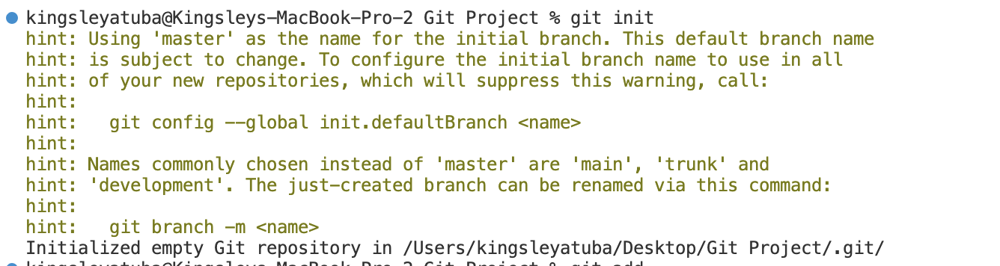

# Git Project
Git is a distributed version control system that allows developers to track changes in their codebase over time. It provides a mechanism for multiple contributors to collaborate on software development, enabling them to make changes to the code, track these changes, and merge their work seamlessly. Git records each change as a commit, which serves as a snapshot of the code at a specific point in time.

GitHub, on the other hand, is a web-based platform that utilizes Git for version control. It hosts Git repositories and provides a collaborative environment for software development projects. Developers can use GitHub to store, share, and collaborate on code, making it a popular platform for open-source projects and team-based software development. GitHub offers features such as issue tracking, pull requests, and integration with various tools to enhance the development and collaboration process.

## Initializing a Repository and Making Commits
`git init` is a Git command that initializes a new repository for version control in a specific directory. When you run git init in a directory, Git creates a hidden subdirectory called .git, where it stores all the configuration, tracking, and version control information for the project. This command essentially tells Git to start managing the project's files, allowing you to track changes and create commits. Once a repository is initialized, you can use other Git commands like git add and git commit to begin tracking and managing your project's source code.

> To initialize a Git repository for a project, follow these steps:
* Open a Terminal: Open your command line terminal on your computer.
* Navigate to Your Project's Directory: Use the cd command to navigate to the directory where your project is located. For example: `cd /path/to/your/project`


* Initialize a Git Repository: Use the git init command to create a new Git repository in the current directory: `git init`



## Making your first Commit
Making your first commit in Git is a crucial step in tracking and recording changes in your project. After initializing a Git repository and making changes to your code, you can use the git add command to stage the changes you want to include in the commit. For example, `git add .` stages all changes in the current directory. Once the changes are staged, you can commit them using the git commit command, along with a descriptive message using the -m flag, such as `git commit -m "Initial commit"`. This message should briefly summarize the changes or the purpose of the commit, providing a clear record of your project's history.

> To make your first commit:
* Adding files to the staging area by running: `git add .`
* Committing changes with a message by running: `git commit -m "first commit"`


## Working with branches
Working with branches in Git allows you to work on different features or aspects of your project independently. You can create a new branch using the `git checkout -b branch-name` command, where branch-name is the name of the new branch. This branch will be based on the current state of your project. To switch between branches, use `git checkout branch-name`. 

You can develop new features or make changes in separate branches without affecting the main branch (often called "master" or "main"). Once you are satisfied with your changes, you can merge or integrate them into the main branch, ensuring a controlled and organized development workflow.

* Create a new branch: `git checkout -b test-branch`


* List your Git branches: `git branch`


* Switch back to main: `git checkout main`


* Merge your branch into main: `git merge test-branch`


* Delete your branch after merging it: `git branch -d test-branch`


## Collaboration and Remote Repositories
Collaboration and Remote Repositories are pivotal aspects of modern software development, enabling teams to work efficiently and seamlessly across different locations and time zones. In this context, Git plays a crucial role in facilitating collaboration by allowing users to add remote repositories using commands like `git remote add origin https://github.com/atubak400/Git-Project.git`. Transitioning from the traditional "master" branch to "main" with `git branch -M main` reflects an inclusive and more meaningful approach to version control.

Pushing changes with `git push -u origin main` not only syncs local and remote repositories but also establishes tracking, making it easier for team members to stay up to date with the project. Cloning a remote repository using `git clone https://github.com/atubak400/Git-Project.git` allows developers to replicate the project locally, fostering a collaborative and distributed development environment. In the world of software development, Collaboration and Remote Repositories are indispensable for fostering teamwork and enabling contributions from across the globe.


## Introduction to Markdown Syntax and Tagging
Markdown Syntax and Tagging provides a fundamental understanding of a lightweight markup language used for formatting text in a simple and readable manner. Markdown is versatile and widely adopted in documentation, including software development, and social media platforms. It allows users to create rich text formatting through the use of tags and syntax, making it an excellent choice for writers and developers alike. In this introduction, you'll learn how to use Markdown to enhance your text with headings, lists, links, and other formatting elements, making your content more visually appealing and structured. For example:

> This code:


> will render:

# Heading 1
## Heading 2
### Heading 3


- Unordered List Item 1
- Unordered List Item 2

1. Ordered List Item 1
2. Ordered List Item 2


*Italic Text*
_Italic Text_

**Bold Text**
__Bold Text__


[Link Text](https://www.example.com)


`Inline Code`

```python
def multiline_code():
    print("Hello, World!")

def add_numbers(a, b):
    return a + b
```

<!-- Comments: Use backticks for inline code and triple backticks to create code blocks. -->

> Blockquote
>> Nested Blockquote

<!-- Comments: Create blockquotes using the '>' symbol, and you can nest blockquotes for deeper levels of quoting. -->

Horizontal Rule:
---

<!-- Comments: Use '---' or '___' to create a horizontal rule. -->

| Header 1 | Header 2 |
| -------- | -------- |
| Content 1 | Content 2 |

<!-- Comments: Create tables using '|' to separate columns and '-' for the header separator. -->

* Bullet point 1
    - Subpoint A
    - Subpoint B
* Bullet point 2

<!-- Comments: You can nest bullet points for subpoints. -->

1. Numbered item 1
   1. Subitem A
   2. Subitem B
2. Numbered item 2

<!-- Comments: You can also nest numbered items for subitems. -->

[Link to Google][Google]
[Google]: http://www.google.com

<!-- Comments: Define link references at the bottom of your document and use them in the text. -->


